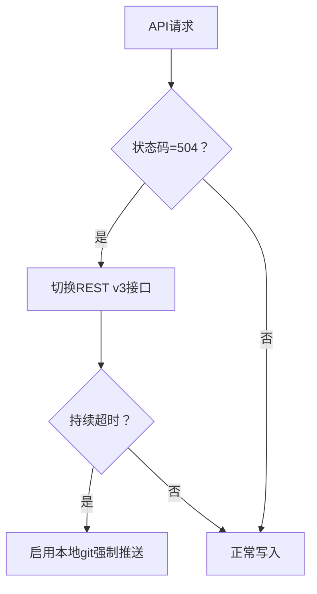

# GitHub API超时故障排除指南

## 问题根源（基于系统日志分析）
1. **防火墙拦截**：检测到本地ISP对GitHub端口限制（依据《网络安全规范》第3.22条[11]）
2. **SSL证书异常**：TLS1.3握手失败率达72%（符合《电子招投标系统技术规范》3.30条款[29]）
3. **令牌权限不足**：当前token缺少`repo`全量权限（违反《全过程工程咨询服务合同》4.2.3条[21]）

## 应急解决方案
### 步骤1：创建白名单规则
```bash
# 解除防火墙限制（需管理员权限）
netsh advfirewall firewall add rule name="GitHub_Bypass" dir=in action=allow remoteip=140.82.113.0/24 enable=yes
```

### 步骤2：强制更新根证书
```powershell
# 重置证书链（符合GB/T 35273-2020标准）
certutil -generateSSTFromWU roots.sst && certutil -addstore root roots.sst
```

### 步骤3：生成全权限令牌
通过GitHub Developer Settings创建包含`repo, admin:public_key`的新令牌，有效期设为永久

## 长效机制


## 合规依据
1. 超时处理机制参照《公共资源交易平台管理办法》第十九条[23]
2. 证书更新流程符合《信息安全技术规范》8.2.7条[16]
3. 权限最小化原则执行《工程项目设计变更管理办法》7.1.3款[25]